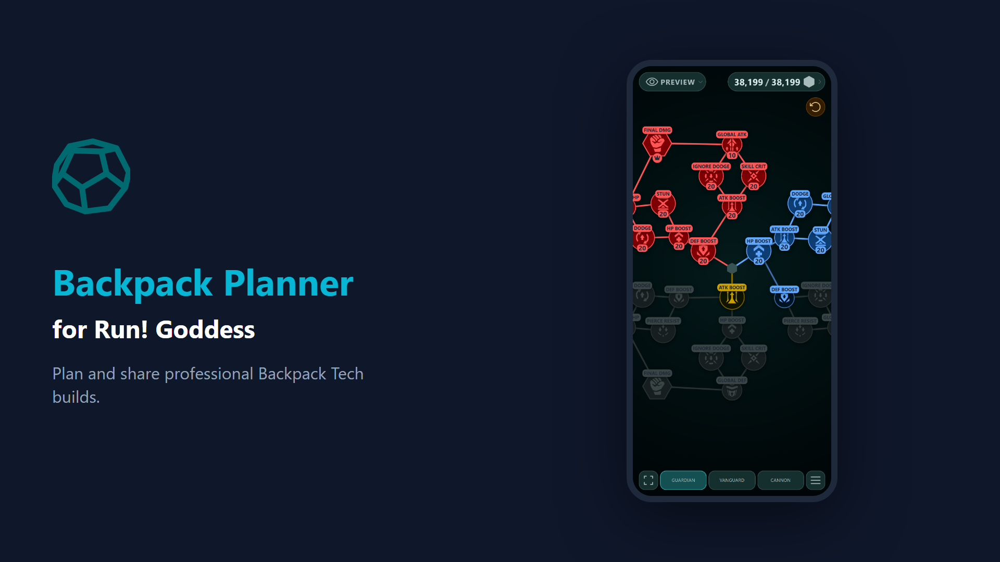

# Backpack Planner

**Plan and share Backpack Tech builds for *Run! Goddess*.**

[**Open the app →**](https://rgbp.app)
Game: [Run! Goddess](https://rungoddess.topgamesinc.com)

---

[**Watch the full showcase video**](showcase-video/out/video.mp4)

---

## Features

- **Interactive skill trees** — Tap or click nodes to level Guardian, Vanguard, and Cannon trees. Pan, zoom, and explore full builds.
- **Smart leveling** — Levels sync along connected paths. Leaf cap enforces the game's 3-leaf limit.
- **Tech Crystal tracking** — Enter your crystals and see build costs at a glance.
- **Save and organize** — Multiple named presets with auto-save. Try premade starter builds to get ideas.
- **Share builds** — Generate a link or export a screenshot of all three trees. Preview shared builds before cloning.
- **Installable PWA** — Works offline, installs to your home screen, optimized for phones, tablets, and desktops.
- **Themes** — Light and dark mode with customizable accent colors.
- **Languages** — English, Japanese, and Chinese.

## Credits

Icons from **[250 Sci-fi Flat Icons](https://katgrabowska.itch.io/250-sci-fi-flat-icons)** by [KatGrabowska](https://katgrabowska.itch.io/) (CC BY 4.0).
