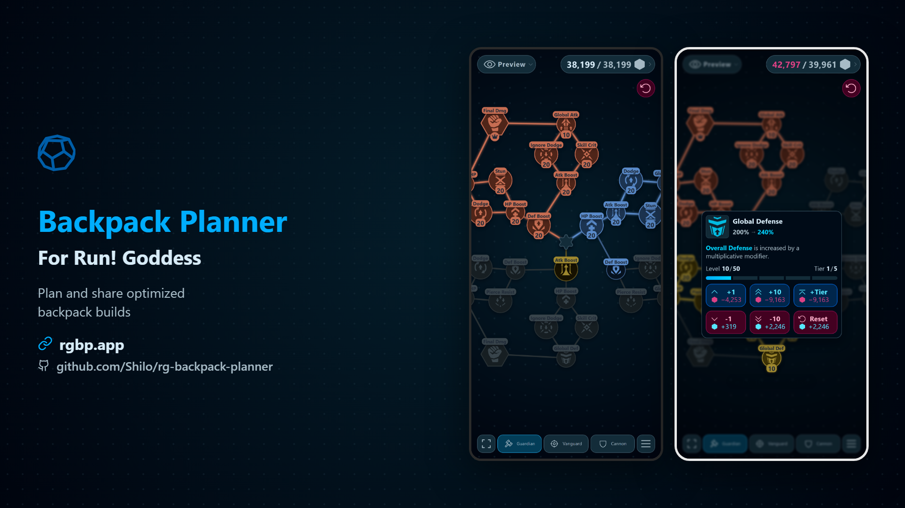

# Backpack Planner

**Plan and share Backpack Tech builds for *Run! Goddess*.**

[**Open the app →**](https://rgbp.app)
Game: [Run! Goddess](https://rungoddess.topgamesinc.com)

---

[**Watch the full showcase video**](showcase-video/out/en/backpack_planner_showcase.mp4)

---

## Features

### Plan Your Builds
- **Interactive skill trees** — Tap or click nodes to level Guardian, Vanguard, and Cannon trees. Pan and zoom to explore.
- **Smart leveling** — Levels sync along connected paths. Leaf cap enforces the game's 3-leaf limit.
- **Undo and redo** — Step backward and forward through node leveling and budget changes. History tracks across all trees.
- **Node context menu** — Right-click or long-press a node to increment/decrement by 1, 10, or tier, or set to max.
- **Tree context menu** — Right-click or long-press empty space to reset, zoom to fit, or manage the tree.

### Track Your Progress
- **Tech Crystal tracking** — Enter how many crystals you own and see per-tree and total costs at a glance.
- **Statistics** — View backpack bonuses, crystal spend, and node level totals. Copy stats as text or share as an image.
- **Visual feedback** — Nodes show locked, available, active, and maxed states. Level-up splash animation on milestones.

### Save and Organize
- **Multiple presets** — Save, rename, clone, reorder, and delete named builds.
- **Auto-save** — Your active build saves automatically.

### Share With Others
- **Share links** — Generate a full or short URL that encodes your build. Anyone with the link can view it.
- **Screenshot export** — Capture all three trees in one transparent PNG. Copy to clipboard, download, or share directly.
- **Preview mode** — Open a shared link to view a build without overwriting your presets. Clone it when you like it.
- **Recommended builds** — Browse premade builds for different stages of the game (Early Raid, Early PvE, Mid PvE, Late PvE, Late PvP).

### Customize
- **Theme colors** — Choose from preset accent colors (sky, cyan, green, rose, amber, neutral) or pick any custom color.
- **Dark and light mode** — Switch freely; all colors adapt automatically.
- **Colorblind tree colors** — Alternate palette shifts tree region hues for color vision accessibility.
- **Text size** — Scale the UI font from 0.8x to 2.0x.
- **Uppercase text** — Toggle uppercase rendering across the interface.
- **Tree zoom** — Start zoomed to fit, close-up, or detail view.
- **Node display** — Show or hide tier badges, skill names, and level-up splash animations.
- **Node primary action** — Configure tap/click to add 1, 10, or a full tier of levels.
- **Level sync** — Choose whether leveling a node syncs connected nodes or changes only the one you tapped.
- **Haptic feedback** — Vibration on interactions (supported devices).
- **Fullscreen** — Expand the app to fill your screen.
- **Languages** — English, Japanese, Chinese, and French with auto-detection.

### Works Everywhere
- **Installable** — Add to your home screen and use it like a native app. Works offline after first load.
- **Auto-updates** — Always on the latest version. Updates apply in the background.
- **Responsive** — Optimized for phones, tablets, and desktops.
- **Onboarding tutorial** — Interactive walkthrough highlights key controls on first launch. Replay anytime from settings.

### Controls

#### Touch
- **Tap** a node — Primary action (configured in settings).
- **Long-press** a node — Open the node menu.
- **Long-press** empty space or a tab — Open the tree menu.
- **Drag** — Pan the tree.
- **Pinch** — Zoom in and out.
- **Swipe right** on the side menu — Close the menu.

#### Mouse and Keyboard
- **Left-click** a node — Primary action (configured in settings).
- **Shift + left-click** or **middle-click** a node — Refund levels.
- **Right-click** a node — Open the node menu.
- **Right-click** empty space or a tab — Open the tree menu.
- **Click and drag** — Pan the tree.
- **Scroll wheel** or **trackpad** — Zoom.
- **Tab** — Cycle between trees or menu tabs.
- **Backspace** — Reset the active tree.
- **Escape** — Open or close the side menu.
- **F9** — Open the screenshot composer.

---

## Credits

Icons from **[250 Sci-fi Flat Icons](https://katgrabowska.itch.io/250-sci-fi-flat-icons)** by [KatGrabowska](https://katgrabowska.itch.io/) (CC BY 4.0).

Showcase video music from **[Cinematic Trailer Music - Collection](https://gregor-quendel.itch.io/cinematic-trailer-music-collection)** by [Gregor Quendel](https://gregor-quendel.itch.io/) (CC BY-NC 4.0).
